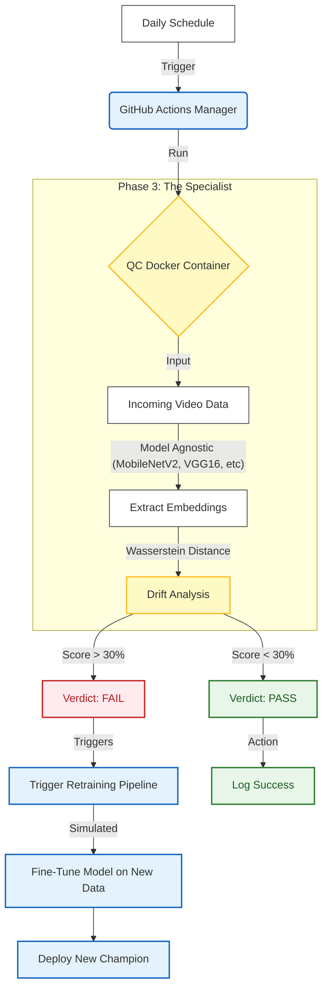

# Sentinel: Automated Model Monitoring & Self-Healing Pipeline

## Table of Contents

- [The Architecture](#the-architecture)
- [Project Status: The Simulation](#project-status-the-simulation)
- [The Self-Healing Loop (How it Works)](#the-self-healing-loop-how-it-works)
- [Tech Stack & Design Patterns](#tech-stack--design-patterns)
- [The Workflow](#the-workflow)
  - [1. The "Saboteur" (Data Simulation)](#1-the-saboteur-data-simulation)
  - [2. The "Endpoint" (Modular Monitoring)](#2-the-endpoint-modular-monitoring)
  - [3. The "Red Phone" (Automated Retraining)](#3-the-red-phone-automated-retraining)
- [How to Run This Project](#how-to-run-this-project)
  - [1. Build the Monitor](#1-build-the-monitor)
  - [2. Run the Saboteur (Create Bad Data)](#2-run-the-saboteur-create-bad-data)
  - [3. Run the QC Check Manually](#3-run-the-qc-check-manually)
- [Future Roadmap (Scaling to Production)](#future-roadmap-scaling-to-production)
  - [Immediate Refinements (Next 2 Weeks - Local Development Focus)](#immediate-refinements-next-2-weeks---local-development-focus)
  - [Deep Learning & MLOps Expansions](#deep-learning--mlops-expansions)
  - [Infrastructure & Cloud Migration](#infrastructure--cloud-migration-delayed)

## The Architecture
*"Models degrade. Good systems heal themselves."*

This project implements an **end-to-end MLOps Drift Detection System** for a Video Frame Interpolation (VFI) model. Instead of manually checking for performance decay (**fondly named "wobbly chairs"**) or data quality issues (**"softwood"**), this system automates the entire **Quality Control loop** using **Containerized Microservices** and **CI/CD Orchestration**.

---

## Project Status: The Simulation
To test this system properly, I am currently running it in a controlled, **simulated environment**. This allows me to prove that the "safety net" works before trusting it with a live model.

| Component | Status | Notes |
| :--- | :--- | :--- |
| **The Model** | 🔹 **Simulated** | My actual VFI model is currently still in training. For now, I am using a "mock" (a stand-in) to ensure the monitoring system triggers correctly, regardless of the specific model inside. |
| **Data Source** | 🔹 **Synthetic** | I created specific test data to "force" the system to react. By feeding it intentionally perfect or intentionally bad data, I can guarantee that the system correctly spots the difference between a **PASS** and a **FAIL**. |
| **Scalability** | 🔹 **Modular Design** | Currently, this detects drift in **Video** inputs. However, the system is built like building blocks. In the future, I can easily "snap in" new blocks for Audio or Text models without breaking the existing structure. |

---

## The Self-Healing Loop (How it Works)



## Tech Stack & Design Patterns

| Component | Tech | Role (The Factory Analogy) |
| :--- | :--- | :--- |
| **Drift Detection** | TensorFlow / **MobileNetV2** | The QC Sensor: Uses Transfer Learning to extract feature **embeddings** from video frames (The "Touch Test"). |
| **Statistical Analysis** | SciPy (**KS Test**) | The Judge: Compares production data against a known "**Golden Baseline**" to quantify distribution shift. |
| **Infrastructure** | **Docker** | The QC Booth: A portable, isolated environment that ensures the monitor runs identically on any machine. |
| **Orchestration** | **GitHub Actions** | The Manager: Automates the schedule, manages the container lifecycle, and handles the "**Red Phone**" logic. |

---

## The Workflow

### 1. The "Saboteur" (Data Simulation)
To prove the system works, I built a `data_saboteur.py` script that synthetically generates **"drifted" data** (noise, blur, low-light) to simulate real-world camera failures.

### 2. The "Endpoint" (Modular Monitoring)
The monitoring logic is decoupled from the orchestration.

* It runs as a **stateless Docker Container**.
* It accepts a volume of data and a baseline reference.
* It outputs a strictly typed status (`PASS`/`FAIL`) and a **Drift Score**.

> **Why this matters:** This architecture is **model-agnostic**. I can swap the internal logic for an NLP monitor, and the infrastructure remains unchanged.

### 3. The "Red Phone" (Automated Retraining)
When drift is detected (*p-value* < 0.05), the system doesn't just alert—it acts. The primary workflow automatically triggers a secondary **Retraining Pipeline** via the GitHub CLI, simulating a **continuous training (CT) loop**.

---

## How to Run This Project

**Prerequisites:**

* Docker installed
* Python 3.9+

### 1. Build the Monitor:
```bash
docker build -t vfi-monitor .
```

### 2. Run the Saboteur (Create Bad Data):
```bash
python data_saboteur.py
```

### 3. Run the QC Check Manually:
```bash
docker run \
  -v $(pwd)/data/drifted_frames:/app/incoming_data \
  -v $(pwd)/temp_status:/app/status_output \
  vfi-monitor
```

### Future Roadmap (Scaling to Production)

#### Immediate Refinements (Next 2 Weeks - Local Development Focus)

These steps are designed to be completed fully offline to optimize resources:

* ~~**Visualization Dashboard:** Connect the **Drift Score** output to a **Grafana** or **Streamlit** dashboard. This will provide a real-time "Pulse Check" of the system, visualizing how the Data Drift fluctuates over time.~~
* ~~**Decoupling:** Complete the implementation of external configuration management (e.g., Environment Variables, K8s ConfigMaps) to remove all hardcoded parameters.~~

#### Deep Learning & MLOps Expansions

* **Model Drift (Concept Drift):** The system currently detects **Data Drift**. The next phase is implementing **Model Decay** detection. This will involve creating a feedback loop to compare predictions against ground truth labels.
* **Horizontal Scaling (Model Agnosticism):** Once the VFI pipeline is perfected, I will generalize the architecture. The aim is for a modular monitoring approach that can easily monitor models pulled directly from **Hugging Face** or **Kaggle** using the same Sentinel container.
* **A/B Testing:** Implement a **Canary Deployment** strategy, allowing the "Champion" model and the "Challenger" model to run side-by-side on live data to compare performance safely.

#### Infrastructure & Cloud Migration (Delayed)

* **Cloud Deployment:** Deploy the VFI Model and the Sentinel Monitor to **Google Cloud Platform (GCP)**.
* **Orchestrator Upgrade:** Migrate the orchestration layer from GitHub Actions to **Kubernetes (K8s)** to demonstrate production scaling, service management, and high availability.
